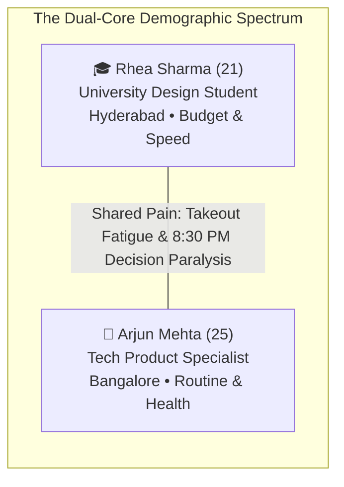
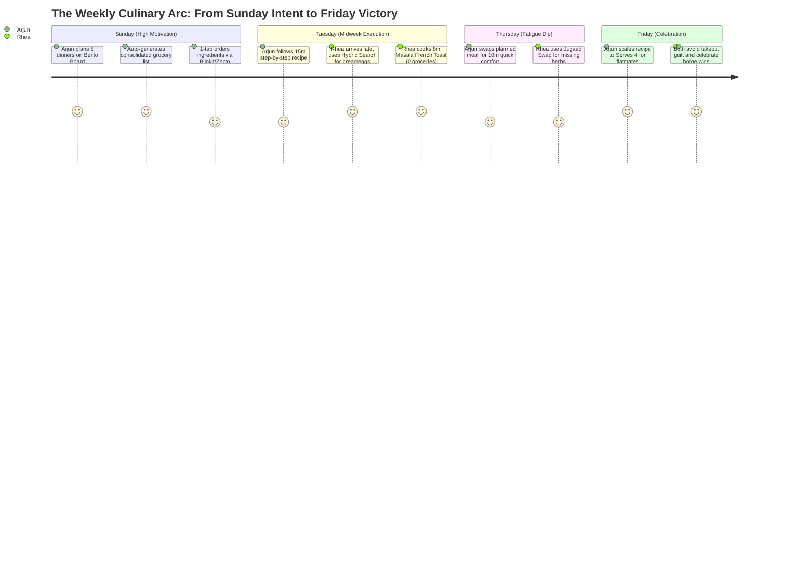

# PHASE 2: EMPATHY & USER EXPERIENCE MODELING
**Project Working Title:** CravePlan (Playful Culinary Operating System)  
**Document Type:** Phase 2 User Experience & Behavioral Modeling  
**Creative Director & Product Lead:** Aarchi (Fashion Communication, NIFT Hyderabad)  
**Technical Architect & UX Mentor:** Antigravity  
**Repository Location:** `Aarchi_BD-24-1972/PHASE_2_USER_MODEL.md`  
**Status:** Phase 2 Complete & Approved  

---

## 1. SOCIO-CULTURAL CONTEXT & GEOGRAPHIC FOUNDATION

### 1.1 The Indian Urban Metro Reality
CravePlan is anchored in the lived realities of India's fast-paced metropolitan hubs (**Hyderabad, Bangalore, Mumbai**). This environment directly dictates how young adults interact with kitchens:

1. **The 10-Minute Q-Commerce Reflex:** Traditional weekly supermarket trips are largely replaced by **Zepto, Blinkit, and Swiggy Instamart**. Ingredients are purchased on demand when cravings strike or missing items are discovered.
2. **The Rental Flatmate Spatial Constraint:** Young students and professionals live in rented 2BHK/3BHK apartments with shared refrigeration (often just 1 shelf per flatmate) and basic induction or 2-burner gas setups. Storage for bulk groceries is minimal.
3. **The Dual Cravings Palette:** Everyday routines oscillate between comforting **Ghar ka Khana** (Dal Tadka, Poha, Paneer Bhurji) and modern **Global Café Culture** (Truffle Pasta, Sourdough Avo Toast, Korean Chili Bowls).

---

## 2. DUAL-CORE USER PERSONAS

---

### Persona 1: Rhea Sharma (21) — "The Studio Sprinter"
* **Demographic:** 3rd-Year Fashion & Design Student at NIFT Hyderabad.
* **Living Arrangement:** Shared 3BHK flat in Gachibowli with 2 design batchmates.
* **Financial Reality:** Strict student monthly budget; feels deep anxiety spending ₹300+ on late-night Swiggy/Zomato orders.
* **Kitchen Infrastructure:**
  * Single induction cooktop, electric kettle, 1 non-stick frying pan, 1 chef knife.
  * Exactly 1 designated shelf in the shared refrigerator.
  * Shared basic spice box (haldi, mirchi, namak, jeera, oil).

#### Behavioral Rhythm & Emotional Triggers:
* **Typical Day:** 9:00 AM class sprint $\rightarrow$ 6 hours in design studio $\rightarrow$ client/project submission rush $\rightarrow$ returns to flat at 10:30 PM physically and mentally drained.
* **The Critical Friction Moment:**
  > *"It’s 10:30 PM. I haven't eaten since a canteen chai at 4 PM. I have 2 slices of bread, 2 eggs, and butter. YouTube shows 15-minute chef videos with fancy ingredients I don't own, and I don't want to wait 25 minutes for Zepto or spend ₹150. I just want to cook with what's on my counter in 8 minutes flat."*
* **Primary CravePlan Triggers:**
  * **Hybrid Kitchen Rescue:** Types `"bread eggs"` or taps `[ 🍞 Bread ]` on the hero base selector for an instant 8-minute Masala French Toast.
  * **Jugaad Swaps:** The app tells her: *"No spring onions? Use regular red onions."*
  * **30-Second Micro-Reels:** Visual verification of the food texture without 12 minutes of video blabber.

---

### Persona 2: Arjun Mehta (25) — "The Independent Hustler"
* **Demographic:** Associate Product Specialist at a Series-B Tech Startup.
* **Living Arrangement:** Independent 1BHK rental apartment in Indiranagar, Bangalore.
* **Financial Reality:** Stable disposable income; spending ₹12,000–₹15,000/month on Zomato takeout and feeling physically sluggish.
* **Kitchen Infrastructure:**
  * Modular kitchen with 3-burner gas stove, microwave, mixer-grinder, full refrigerator.
  * Moderately stocked pantry, but fresh vegetables routinely rot because of poor planning.

#### Behavioral Rhythm & Emotional Triggers:
* **Typical Day:** 9:30 AM to 7:30 PM hybrid work schedule (3 days office, 2 days WFH) $\rightarrow$ back-to-back Slack calls, screen fatigue $\rightarrow$ closes laptop at 8:00 PM with decision paralysis.
* **The Critical Friction Moment:**
  > *"I buy fresh veggies on Sunday with high motivation to eat clean. By Wednesday night, after 9 hours of meetings, I open the fridge, see raw veggies, have zero mental energy to decide what recipe to make, give up, and order butter chicken on Zomato. Then on Friday, I throw the rotten veggies in the trash."*
* **Primary CravePlan Triggers:**
  * **The Sunday Bento Meal Board:** 5-minute weekend planning ritual to set 5 weeknight dinners.
  * **Single Living Grocery Checklist:** Consolidates ingredients so nothing goes to waste.
  * **Dynamic Servings Stepper:** Bumps up to `Serves 4` when cooking dinner for friends on Friday night.

---

## 3. SENSORY EMPATHY MAPS

### 3.1 Rhea’s Empathy Map (10:30 PM Studio Burnout)
| Quadrant | User Experience Reality |
| :--- | :--- |
| **THINKS & FEELS** | • "I'm starving but too tired to stand in the kitchen for 40 minutes." • "If I order Swiggy again, my monthly allowance is ruined." • "I want something hot, spicy, and comforting right now." |
| **SEES** | • An empty dining table covered in fabric swatches and laptop chargers. • Half a loaf of bread, 2 eggs, and butter in the kitchen. • Friends sending Instagram reels of cheesy street food. |
| **HEARS** | • Flatmates asking: *"Are we ordering food or making Maggi?"* • Notifications from delivery apps offering 40% discount coupons. |
| **SAYS & DOES** | • Opens fridge, stares blankly for 3 minutes, closes door. • Wants a recipe that guarantees zero extra grocery shopping. |
| **PAINS (Friction)** | Wasting money on takeout, dirty dishes in shared sink, complex chef jargon. |
| **GAINS (Delight)** | Eating hot food in 10 minutes, feeling proud of self-sufficiency, saving money. |

---

### 3.2 Arjun’s Empathy Map (8:00 PM Midweek Decision Fatigue)
| Quadrant | User Experience Reality |
| :--- | :--- |
| **THINKS & FEELS** | • "I want to eat clean and stay in shape, but cooking feels like a second job." • "I hate throwing out vegetables that I bought with good intentions." • "Why does deciding dinner take more mental energy than my actual job?" |
| **SEES** | • A well-equipped kitchen with coriander slowly wilting in the vegetable crisper. • A cluttered Zomato order history full of biryanis and burgers. |
| **HEARS** | • Podcasts advocating healthy lifestyle habits. • Colleagues talking about their weekend meal-prep routines. |
| **SAYS & DOES** | • Tries to cook, realizes he is missing 1 critical ingredient (e.g. ginger/garlic), gives up. • Orders heavy takeout, eats on the couch, feels sluggish next morning. |
| **PAINS (Friction)** | Food waste guilt, decision fatigue after work, inconsistent meal routines. |
| **GAINS (Delight)** | Knowing what dinner is before the day starts, automated grocery checkout, zero waste. |

---

## 4. END-TO-END USER JOURNEY MAP (SUNDAY TO FRIDAY ARC)

---

## 5. PERSONA-TO-FEATURE ARCHITECTURAL MATRIX

| Core Pain Point | Persona Impacted | CravePlan Feature Engine |
| :--- | :--- | :--- |
| **"I have random ingredients & refuse to order groceries"** | Rhea (Student) | **Hybrid Kitchen Rescue:** 3-word search bar + 1-tap Hero Base chips (`Bread`, `Eggs`, `Rice`) with 100% Match indicator. |
| **"Missing 1 minor ingredient stops the entire cook"** | Rhea & Arjun | **Jugaad Swap Engine:** In-app replacement suggestions (e.g., *curd for mayo*, *regular onion for scallions*). |
| **"Midweek decision fatigue causes takeout relapse"** | Arjun (Professional) | **Weekly Bento Board:** Visual 7-day schedule with breakfast, lunch, and dinner presets. |
| **"Vegetables rot in the fridge"** | Arjun (Professional) | **Zero-Waste Synergy:** Ingredient consolidation highlighting shared produce across meals. |
| **"Scaling recipes causes mental math anxiety"** | Rhea & Arjun | **Dynamic Servings Stepper:** Live `[-] N [+]` toggle updating ingredient quantities in real time. |
| **"Typing ingredients into delivery apps is tedious"** | Arjun & Rhea | **1-Tap Q-Commerce Deep Link:** Directly pushes missing checklist items to Blinkit / Zepto. |

---

## 6. PHASE GATE SIGN-OFF & TRANSITION

### Status: Phase 2 Approved
* [x] Target demographic narrowed to authentic Dual-Core (Student + Young Professional).
* [x] Indian Urban Metro Context formalized (Hyderabad/Bangalore Q-commerce and rental living).
* [x] Rhea Sharma & Arjun Mehta persona profiles fully articulated.
* [x] Sensory Empathy Maps and Sunday-to-Friday Journey Map mapped.
* [x] Hybrid Kitchen Rescue and Jugaad Swaps integrated into the behavioral model.

### Up Next: **Phase 3: Information Architecture & Taxonomy**
* Global Navigation Structure & Hierarchy (Tabs, Drawers, Sheets).
* Card Sorting & Content Inventory (Recipe Taxonomy, Mood Tags, Aisle Schema).
* Sitemaps & Relational Linking (Search $\leftrightarrow$ Recipe Card $\leftrightarrow$ Bento Board $\leftrightarrow$ Grocery Basket).
