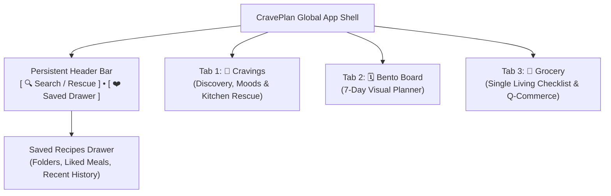
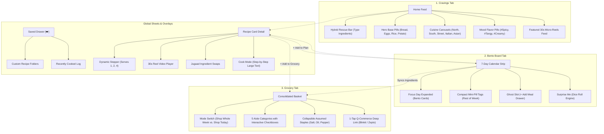

# PHASE 3: INFORMATION ARCHITECTURE & TAXONOMY SPECIFICATION
**Project Working Title:** CravePlan (Playful Culinary Operating System)  
**Document Type:** Information Architecture (IA) Blueprint & Data Schema  
**Creative Director & Product Lead:** Aarchi (Fashion Communication, NIFT Hyderabad)  
**Technical Architect & UX Mentor:** Antigravity  
**Repository Location:** `Aarchi_BD-24-1972/PHASE_3_IA_SPEC.md`  
**Status:** Phase 3 Complete & Approved  

---

## 1. GLOBAL NAVIGATION ARCHITECTURE

### 1.1 The "Power-of-Three" Core Structure
To eliminate navigation ambiguity and cognitive fatigue, CravePlan adopts a **focused 3-Tab Primary Navigation** paired with a persistent **Header Utility Anchor** for saved recipes.



### 1.2 Persistent Top Header Bar Specs
The top header remains context-aware across all screens:
* **Left Anchor:** Greeting / Context status (`"Hey Rhea 👋"` or `"Cooking for 2 today"`).
* **Right Anchor:** `[ ❤️ Saved ]` badge icon with a numerical badge (`14`).
  * *Interaction:* Tapping smoothly slides open the **Saved Collections Sheet** without abandoning the active tab.

### 1.3 Bottom Navigation Bar Specs (The 3 Pillars)
| Tab Item | Visual Icon | Functional Role | Primary User Action |
| :--- | :--- | :--- | :--- |
| **1. Cravings** | 🍜 Bowl Icon | Inspiration, Cuisines & Instant Rescue | Search by ingredients, browse moods, watch 30s micro-reels. |
| **2. Bento Board** | 🗓️ Calendar Icon | 7-Day Visual Planning | Assign meals to Breakfast, Lunch, and Dinner slots; shuffle week. |
| **3. Grocery** | 🛒 Basket Icon | Smart Consolidated Fulfillment | Check off ingredients, collapse staples, 1-tap export to Zepto/Blinkit. |

---

## 2. DETAILED SCREEN SITEMAP & DRILL-DOWN BLUEPRINT



---

## 3. MULTI-AXIAL CONTENT TAXONOMY & DATA SCHEMAS

### 3.1 Recipe Metadata Schema
Every recipe in CravePlan is governed by five orthogonal (non-conflicting) taxonomy dimensions:

```
┌────────────────────────────────────────────────────────────────────────┐
│                      RECIPE METADATA FORMULA                           │
│  [Identity] + [Cuisine Axis] + [Mood Axis] + [Constraint Axis] + [Media]│
└────────────────────────────────────────────────────────────────────────┘
```

1. **Identity & Editorial Assets:**
   * `id`: Unique string (`recipe_truffle_pasta_01`).
   * `title`: Editorial title (`"Mushroom & Truffle Cream Pasta"`).
   * `hero_image`: High-res appetizing food photography / hand-drawn illustration.
   * `micro_reel_url`: Curated 30-second YouTube Short / TikTok video embed.
   * `description`: Punchy 2-sentence culinary summary.

2. **Cuisine Classification (Geographic & Cultural Tradition):**
   * 🫓 `North Indian` (Dals, Paneer gravies, Parathas)
   * 🥥 `South Indian` (Dosan, Idli, Podi bowls, Curd rice)
   * 🥟 `Street Food` (Chaat, Momos, Frankie rolls, Kathi wraps)
   * 🍝 `Continental & Italian` (Pastas, Burgers, Sourdough melts, Risottos)
   * 🥢 `Asian & Chinese` (Ramen, Chili garlic noodles, Fried rice, Stir-fry)

3. **Mood & Flavor Cravings (Sensory Profile):**
   * 🔥 `#Spicy` (Chili-forward, bold, pepper, tadka)
   * 🍋 `#Tangy` (Chatpata, citrus, tamarind, tomato-rich)
   * 🧀 `#Creamy` (Comforting, dairy/coconut rich, silky, cheesy)
   * 🌿 `#Fresh` (Clean, crunchy, herb-forward, light digestion)
   * 🍯 `#SweetTooth` (Dessert fixes, mug cakes, sweet breakfasts)

4. **Hard Constraints & Dietary Boundaries:**
   * **Dietary Badges:** `🟢 100% Veg` | `🟡 Eggitarian` | `🔴 Non-Veg`
   * **Prep Time:** `⏱️ Under 10m` | `⏱️ 15m` | `⏱️ 30m` | `⏱️ Weekend Project (45m+)`
   * **Skill / Appliance Level:** `Single-Pan` | `Induction Friendly` | `Oven Required`

---

### 3.2 Ingredient Data Model & Aggregation Formula
To allow seamless math calculation when scaling servings and aggregating items into the grocery basket:

$$\text{Ingredient} = \{\text{id}, \text{name}, \text{base\_qty}, \text{unit}, \text{category}, \text{is\_staple}, \text{jugaad\_swap}\}$$

#### Example Record:
```json
{
  "id": "ing_mushrooms_button",
  "name": "Button Mushrooms",
  "base_qty": 250,
  "unit": "g",
  "category": "produce",
  "is_staple": false,
  "jugaad_swap": "Can be swapped with 200g paneer cubes or boiled corn"
}
```

#### 5 Universal Supermarket Aisle Categories:
1. 🥬 **Fresh Produce:** Mushrooms, onions, shallots, garlic, herbs, spinach, tomatoes, potatoes.
2. 🥛 **Dairy & Alternatives:** Milk, coconut milk, butter, cheese slices, dahi/yogurt, vegan cream.
3. 🍞 **Bakery & Grains:** Pasta, sourdough, burger buns, rice, noodles, atta, bread.
4. 🧂 **Oils, Sauces & Condiments:** Truffle paste, olive oil, soy sauce, mustard, mayonnaise.
5. 🌶️ **Spices & Seasonings:** Salt, black pepper, chili flakes, oregano, turmeric, jeera.

---

## 4. RELATIONAL DATA BRIDGES & SYNC RULES

### Bridge 1: Recipe Card $\leftrightarrow$ Bento Board
* When a user taps `[ + Add to Plan ]` on any recipe, a lightweight bottom sheet appears asking: `Choose Day & Slot: [Tue] [Dinner]`.
* Once added, the Bento Board shows the card in Tuesday's dinner slot.
* The recipe card immediately updates its state badge to: `📅 Scheduled: Tue Dinner`.

### Bridge 2: Bento Board $\leftrightarrow$ Grocery Basket
* The Grocery Basket listens directly to the active 7-day Bento Board.
* **Consolidation Logic:** If Monday Dinner uses 2 onions and Wednesday Lunch uses 1 onion, the grocery basket displays:
  > **🥬 Fresh Produce:**  
  > `[ ] 3 Red Onions (Used in: Truffle Pasta, Paneer Roll)`
* **The "Assumed Staples" Rule:** Items tagged with `"is_staple": true` (salt, pepper, cooking oil) do not appear in the primary checkout list; they are tucked into the collapsed row: `🧂 4 Kitchen Staples Assumed at Home [ Show/Edit ]`.

### Bridge 3: Dynamic Servings Scaler $\leftrightarrow$ Real-Time Math
* When the user adjusts servings from `2` $\rightarrow$ `4`:
  $$\text{New Quantity} = \text{Base Quantity} \times \left(\frac{\text{New Servings}}{\text{Base Servings}}\right)$$
* Both the recipe instruction quantities and the grocery checklist quantities update in real time.

---

## 5. PHASE GATE SIGN-OFF & TRANSITION

### Status: Phase 3 Completed & Approved
* [x] Navigation reduced and focused to **3 Primary Tabs** (Cravings, Bento Board, Grocery).
* [x] Saved Recipes / Cookbook integrated into sleek header anchor `[❤️]`.
* [x] Multi-axial taxonomy defined (Cuisines, Moods, Constraints, Dietary).
* [x] Ingredient data structure & 5-aisle classification formalized.
* [x] Relational sync rules between Card, Planner, and Basket mapped.

### Up Next: **Phase 4: User Flows & Low-Fidelity Wireframes**
* Screen-by-screen task flows:
  * Flow 1: Rhea’s 10:30 PM "Hybrid Rescue" Flow.
  * Flow 2: Arjun’s Sunday 5-Minute "Plan & Order" Flow.
  * Flow 3: Live Cooking / "Kitchen Cook Mode" Flow.
* Low-fidelity structural wireframe layouts for all key screens.
