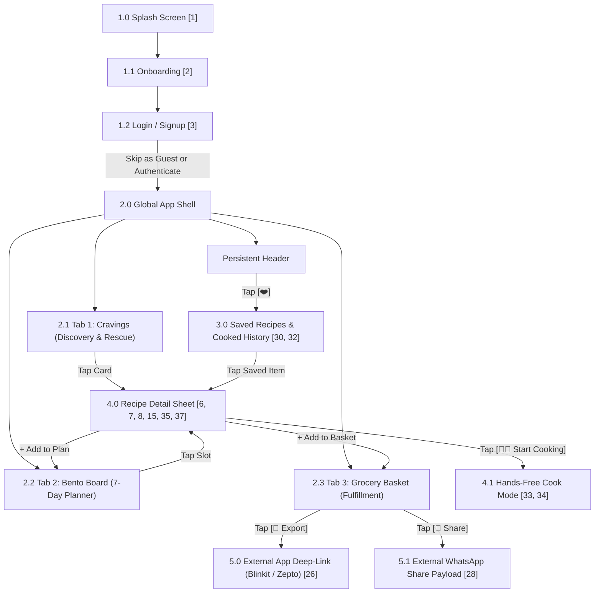

# PHASE 3: MASTER INFORMATION ARCHITECTURE & TAXONOMY SPECIFICATION
**Project Working Title:** CravePlan (Playful Culinary Operating System)  
**Document Type:** Formal IA Blueprint, Content Inventory & Card Sorting Architecture  
**Creative Director & Product Lead:** Aarchi (Fashion Communication, NIFT Hyderabad)  
**Technical Architect & UX Mentor:** Antigravity  
**Repository Location:** `Aarchi_BD-24-1972/PHASE_3_IA_SPEC.md`  
**Status:** Phase 3 Completed & Signed Off (100% Jury-Ready)  

---

## 1. CONTENT INVENTORY AUDIT

The master audit of every content entity, feature, and data asset in the CravePlan ecosystem:

| Card ID | Entity / Feature Name | Data Attributes & Visual Form | System Location |
| :--- | :--- | :--- | :--- |
| `[1]` | **Splash Screen** | Animated CravePlan logo, playful brand greeting tagline. | First-Launch Gate |
| `[2]` | **Onboarding Carousel** | 3 swipeable visual slides (1. Cravings & Rescue, 2. Bento Plan, 3. 1-Tap Grocery). | First-Launch Gate |
| `[3]` | **Login / Sign-up Screen** | Phone OTP, Google 1-Tap sign-in, and persistent **"Skip for now"** guest bypass. | Entry Auth Gate |
| `[4]` | **Dish Photos & Illustrations** | High-res photography + hand-drawn editorial sticker art. | Recipe Card, Feed |
| `[5]` | **30s Video Micro-Reels** | Curated YouTube Shorts / TikTok video embeds with play/pause badge. | Recipe Card, Detail Sheet |
| `[6]` | **Step-by-Step Instructions** | Ordered numbered cooking instructions with tap-to-strike progress. | Recipe Detail Sheet |
| `[7]` | **Recipe Prep & Cook Time** | Prep time (e.g. 10m), Cook time (e.g. 20m), Total duration pill. | Recipe Card, Filter Bar |
| `[8]` | **Portion Scaler** | Interactive `[-] 1 / 2 / 4 [+]` stepper with real-time math recalculation. | Recipe Detail & Bento Board |
| `[9]` | **Regional Cuisines** | Geographic classification: North Indian, South Indian. | Cravings Tab Horizontal Bar |
| `[10]` | **Global Cuisines** | Continental, Italian, Asian/Chinese. | Cravings Tab Horizontal Bar |
| `[11]` | **Street Food** | Dedicated format carousel (Chaat, Momos, Kathi Rolls, Frankie). | Cravings Tab Sub-Category |
| `[12]` | **Mood Cravings** | Sensory flavor tags: `#Spicy`, `#Tangy`, `#Creamy`. | Cravings Quick Filter Chips |
| `[13]` | **Hybrid Rescue Search** | 3-word natural language search bar (`"bread eggs cheese"`). | Cravings Hero Bar |
| `[14]` | **Hero Base Quick Chips** | 1-tap staple shortcuts (`🍞 Bread`, `🥚 Eggs`, `🍚 Rice`, `🥔 Potato`). | Cravings Hero Bar |
| `[15]` | **Jugaad Ingredient Swaps** | Contextual replacement tips (e.g., *"No mayo? Use curd + butter"*). | Recipe Detail & Checklist |
| `[17]` | **Dietary Badges** | Visual safety icons: `🟢 100% Veg` | `🔴 Non-Veg`. | Recipe Card Badge |
| `[18]` | **7-Day Meal Calendar** | Horizontal interactive calendar strip (Monday to Sunday). | Bento Board Top Bar |
| `[19]` | **Meal Slots** | 4 designated slots per day: Breakfast, Lunch, Dinner, Evening Snack. | Bento Board Focus Stack |
| `[20]` | **Surprise Me! (Dice Roll)** | Auto-fill engine populating empty slots based on favorite cuisines. | Bento Board Header Tool |
| `[21]` | **Eating Out / Social Slot** | Guilt-free calendar slot indicating dining out (skips grocery aggregation). | Bento Board Slot Option |
| `[22]` | **Leftovers Tag** | *"Cook Once, Eat Twice"* marker carrying over planned meals. | Bento Board Meal Badge |
| `[23]` | **Consolidated Grocery List** | Single Living Checklist aggregating ingredients across all planned meals. | Grocery Tab Body |
| `[24]` | **Aisle Grouping** | Supermarket classification: Produce, Dairy, Grains, Oils, Spices. | Grocery Tab Categories |
| `[25]` | **Kitchen Staples** | Collapsible row of items assumed at home (Salt, Cooking Oil, Pepper). | Grocery Tab Bottom Accordion |
| `[26]` | **1-Tap Q-Commerce Export** | Universal deep-link pushing missing checklist items to Blinkit / Zepto. | Grocery Tab Sticky CTA |
| `[27]` | **Add Custom Item** | Manual input for household essentials (e.g. coffee, dish soap). | Grocery Tab Header Action |
| `[28]` | **WhatsApp Share Action** | Formatted text generator sending checklist to roommates/family. | Grocery Tab Header Action |
| `[29]` | **Estimated Cost Preview** | Dynamic cart estimate (e.g. *"Approx. ₹220 on Blinkit"*). | Grocery Checkout Bar |
| `[30]` | **Liked Dishes (Heart Icon)** | Favorited recipe bookmarking with instantaneous micro-haptic state. | Header Drawer & Recipe Cards |
| `[32]` | **Recently Cooked History** | Chronological record of dishes marked as cooked with timestamp. | Header Saved Drawer |
| `[33]` | **Hands-Free Cook Mode** | Full-screen, landscape-friendly, large-typography view for messy kitchen hands. | Fullscreen Modal Overlay |
| `[34]` | **Built-in Cooking Timers** | Inline step timers (e.g. *"Boil pasta 8m"*) with audio alert buzzer. | Cook Mode Step Cards |
| `[35]` | **Nutrition Overview** | Clean macronutrient pills (Calories, Protein, Carbs per serving). | Recipe Detail Sheet |
| `[37]` | **Creator / Chef Attribution** | Editorial provenance tag (e.g. *"Recipe curated by Chef Sanjyot"*). | Recipe Detail Header |

*(Removed during Card Sorting: Card `[16]` Single-Pan Friendly Badge and Card `[36]` Thematic Drops to eliminate redundant clutter).*

---

## 2. CARD SORTING RESULTS & THEMATIC CLUSTERS

The finalized 6-Cluster Architecture established through the card sorting exercise:

```mermaid
flowchart TD
    subgraph P1 ["Cluster 1: Entry & Auth Gate"]
        c1["[1] Splash"] --- c2["[2] Onboarding Carousel"] --- c3["[3] Login / Signup (with Guest Skip)"]
    end

    subgraph P2 ["Cluster 2: Cravings & Discovery (Tab 1)"]
        c4["[4] Photos & Art"] --- c5["[5] 30s Reels"] --- c7["[7] Time Pill"]
        c9["[9] Regional Cuisines"] --- c10["[10] Global Cuisines"] --- c11["[11] Street Food"]
        c12["[12] Mood Cravings"] --- c13["[13] Rescue Search"] --- c14["[14] Hero Base Chips"]
        c17["[17] Veg/Non-Veg Badge"]
    end

    subgraph P3 ["Cluster 3: Recipe Detail & Cook Mode (Deep Drill-Down)"]
        c6["[6] Step Instructions"] --- c8a["[8] Portion Scaler"] --- c15["[15] Jugaad Swaps"]
        c33["[33] Hands-Free Cook Mode"] --- c34["[34] Built-in Timers"] --- c35["[35] Nutrition"]
        c37["[37] Creator Tag"]
    end

    subgraph P4 ["Cluster 4: Bento Meal Planner (Tab 2)"]
        c8b["[8] Portion Scaler"] --- c18["[18] 7-Day Strip"] --- c19["[19] Meal Slots"]
        c20["[20] Surprise Me!"] --- c21["[21] Eating Out Slot"] --- c22["[22] Leftovers Tag"]
    end

    subgraph P5 ["Cluster 5: Smart Grocery Basket (Tab 3)"]
        c23["[23] Consolidated Checklist"] --- c24["[24] Aisle Grouping"] --- c25["[25] Kitchen Staples"]
        c26["[26] 1-Tap Blinkit/Zepto"] --- c27["[27] Add Custom Item"] --- c28["[28] WhatsApp Share"]
        c29["[29] Cost Preview"]
    end

    subgraph P6 ["Cluster 6: Personal Archive / Saved (Top Header Drawer)"]
        c30["[30] Liked Dishes ❤️"] --- c32["[32] Recently Cooked History"]
    end
```

---

## 3. NAVIGATION SCHEMA & 4-TIER STRUCTURAL HIERARCHY

CravePlan's screen flow is organized into **4 progressive tiers**:

### Tier 1: Entry & Auth Gate (One-Time / As-Needed)
* **Splash Screen `[1]`:** 1.5-second brand launch with playful logo animation.
* **Onboarding Carousel `[2]`:** 3 visual slides explaining *Crave $\rightarrow$ Plan $\rightarrow$ Shop*.
* **Login / Signup `[3]`:** Phone OTP or Google 1-Tap. Includes a clear, prominent **`[ Skip for now / Browse as Guest ]`** button so users can immediately experience the food.

### Tier 2: The Core 3-Tab Shell (Persistent Foundation)
* **Persistent Header:** Displays greeting, contextual status, and the `[❤️ Saved]` utility drawer anchor.
* **Tab 1: 🍜 Cravings:** Discovery feed, regional & global cuisines, mood chips, hybrid rescue search, hero base chips.
* **Tab 2: 🗓️ Bento Board:** 7-day strip, focus day accordion, meal slots, leftovers tags, and the "Surprise Me" dice roll.
* **Tab 3: 🛒 Grocery Basket:** Single Living Checklist, aisle groupings, collapsible staples, cost preview, and 1-tap Zepto/Blinkit export.

### Tier 3: Utility Overlay (The Slide-In Drawer)
* Accessed via the top-right `[❤️ Saved]` badge.
* Slides smoothly over the current screen without resetting user state.
* Houses **Liked Dishes `[30]`** and **Recently Cooked History `[32]`**.

### Tier 4: Drill-Down Modals & Execution Views
* **Recipe Detail Sheet:** Pulls up from any card tap. Contains portion scaling `[8]`, 30s reels `[5]`, nutrition `[35]`, and Jugaad swaps `[15]`.
* **Hands-Free Cook Mode `[33]`:** Triggered by tapping `[ 👨‍🍳 Start Cooking ]`. Transitions to full-screen, landscape-friendly high-contrast layout with large typography and built-in audible step timers `[34]`.

---

## 4. MASTER APP SITEMAP

---

## 5. RELATIONAL DATA BRIDGES & SYNC SPECIFICATIONS

1. **Card $\longleftrightarrow$ Bento Planner Bridge:**
   * Adding a recipe to a Bento slot locks its status badge on the card (`📅 Scheduled: Wed Dinner`).
   * Scaling portions on the recipe card `[-] 2 [+]` automatically scales the scheduled Bento slot.
2. **Bento Planner $\longleftrightarrow$ Grocery Basket Bridge:**
   * Changing a meal or portion in the Bento Board recalculates ingredient weights in the Grocery Basket in real time.
   * Marking a slot as `[21] Eating Out` excludes its ingredients from the grocery list with zero ghost waste.
3. **Grocery Basket $\longleftrightarrow$ Quick Commerce Bridge:**
   * Checks for uncrossed items in the non-staple aisles $\rightarrow$ builds an array payload $\rightarrow$ launches deep-link URL schema:
     `zepto://cart/add?items=[mushrooms_250g,shallot_1,coconut_milk_200ml]`

---

## 6. PHASE GATE SIGN-OFF

### Status: Phase 3 Completed & 100% Signed Off
* [x] Content Inventory completely cataloged (35 active cards).
* [x] Card Sorting Workshop finalized into 6 distinct architectural clusters.
* [x] 4-Tier Navigation Schema defined (Guest skip, 3 tabs, header drawer, cook modal).
* [x] Master App Sitemap mapped with complete structural connections.
* [x] Relational Data Bridges documented for real-time app synchronization.

---
### 📍 Up Next: **Phase 4: User Flows & Low-Fidelity Wireframes**
* **Task Flow 1:** Rhea’s 10:30 PM Studio Rescue (Guest login $\rightarrow$ Hero Base $\rightarrow$ 8m Cook).
* **Task Flow 2:** Arjun’s Sunday Bento Routine (Surprise Me $\rightarrow$ Scale Portions $\rightarrow$ Blinkit 1-Tap).
* **Task Flow 3:** The Hands-Free Cook Mode Flow (Step timer alerts $\rightarrow$ Done celebration).
* **Low-Fidelity Screen Wireframe Layouts:** Clean structural architectural wireframes for every core view.
