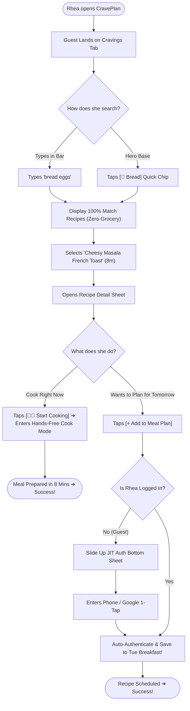
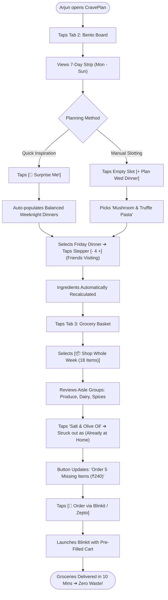
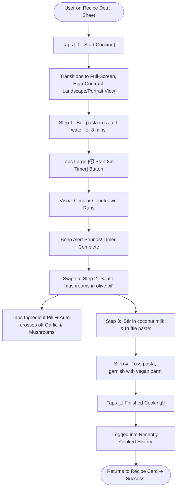

# PHASE 4: USER FLOWS & LOW-FIDELITY WIREFRAME SPECIFICATIONS
**Project Working Title:** CravePlan (Playful Culinary Operating System)  
**Document Type:** Task Flows, Decision Trees & Low-Fidelity Wireframe Blueprints  
**Creative Director & Product Lead:** Aarchi (Fashion Communication, NIFT Hyderabad)  
**Technical Architect & UX Mentor:** Antigravity  
**Repository Location:** `Aarchi_BD-24-1972/PHASE_4_FLOWS_AND_WIREFRAMES.md`  
**Status:** Phase 4 Draft & In Review  

---

## 1. STRATEGIC AUTHENTICATION ARCHITECTURE: JUST-IN-TIME (JIT) ENGAGEMENT

Based on the Creative Director's sign-off, CravePlan eliminates upfront registration barriers in favor of **Contextual / Just-In-Time (JIT) Authentication**:

```
[ First Launch ] ──▶ [ Splash & Onboarding ] ──▶ [ ⚡ Skip to Browse (Guest Mode) ]
                                                            │
                     ┌──────────────────────────────────────┴──────────────────────────────────────┐
                     ▼                                                                             ▼
          FREE EXPLORATION TIER                                                         COMMITMENT ACTION TRIGGER
     • Browse Cravings Feed & Reels                                                • Tap [+ Add to Meal Plan]
     • Free Search ("bread eggs")                                                  • Tap [❤️ Save to Favorites]
     • Open & Read Full Recipe Detail                                              • Tap [🛒 Export to Blinkit/Zepto]
                                                                                                   │
                                                                                                   ▼
                                                                                   [ 🪟 JIT Auth Bottom Sheet ]
                                                                                   • 1-Tap Google / Phone OTP
                                                                                   • Auto-resumes intended action
```

---

## 2. DETAILED END-TO-END USER TASK FLOWS

### Flow 1: Rhea’s Late-Night Studio Rescue & JIT Auth Flow
* **Persona:** Rhea Sharma (21, NIFT Student).
* **Context:** 10:30 PM, arrives at flat tired, searching for recipes with ingredients on hand.



---

### Flow 2: Arjun’s Sunday 5-Minute Bento Routine & 1-Tap Delivery Flow
* **Persona:** Arjun Mehta (25, Product Specialist).
* **Context:** Sunday afternoon, planning weekday meals and ordering groceries without food waste.



---

### Flow 3: Hands-Free "Cook Mode" Execution Flow
* **Persona:** Anyone standing in front of the stove with messy, wet, or oily hands.
* **Context:** Preparing dinner step-by-step with zero phone-screen smudges.



---

## 3. LOW-FIDELITY STRUCTURAL WIREFRAME BLUEPRINTS

### Wireframe 1: First-Launch Gate & Splash / Onboarding
```
┌────────────────────────────────────────────────────────┐
│  [SCREEN 1.0: SPLASH]        [SCREEN 1.1: ONBOARDING]  │
├──────────────────────────────┬─────────────────────────┤
│                              │  [ Skip ]               │
│                              │                         │
│                              │     [ 🎨 Illustration ] │
│           CravePlan          │       "Plan Meals in    │
│       [ 🍜 Logo Mark ]       │        3 Minutes"       │
│                              │                         │
│     "Mood-to-Meal in         │  Turn cravings into     │
│       Zero Friction"         │  weekly bento boards &  │
│                              │  1-tap grocery carts.   │
│                              │                         │
│                              │  ( • ○ ○ )              │
│                              │                         │
│                              │  [ Get Started ]        │
│                              │  [ Browse as Guest > ]  │
└──────────────────────────────┴─────────────────────────┘
```

---

### Wireframe 2: Tab 1 — Cravings (Discovery & Hybrid Rescue)
```
┌────────────────────────────────────────────────────────┐
│  [SCREEN 2.1: TAB 1 - CRAVINGS FEED]                   │
├────────────────────────────────────────────────────────┤
│  Hey Rhea 👋                         [ ❤️ Saved (14) ] │
├────────────────────────────────────────────────────────┤
│  ⚡ HYBRID KITCHEN RESCUE                              │
│  ┌──────────────────────────────────────────────────┐  │
│  │ 🔍 Type what you have (e.g. bread eggs)       🎙️│  │
│  └──────────────────────────────────────────────────┘  │
│  Quick Base: [🍞 Bread] [🥚 Eggs] [🍚 Rice] [🥔 Potato]│
├────────────────────────────────────────────────────────┤
│  EXPLORE CUISINES                                      │
│  [ 🫓 North ] [ 🥥 South ] [ 🥟 Street ] [ 🍝 Italian ] │
├────────────────────────────────────────────────────────┤
│  MOOD CRAVINGS                                         │
│  ( 🔥 #Spicy )   ( 🍋 #Tangy )   ( 🧀 #Creamy )        │
├────────────────────────────────────────────────────────┤
│  FEATURED DISH CARD                                    │
│  ┌──────────────────────────────────────────────────┐  │
│  │ [ 🖼️ Hero Photo / Art ]            [ ▶️ 0:30 Reel ]│  │
│  │                                                  │  │
│  │ CRISPY POTATO & PANEER BURGER     [ 🟢 100% Veg ]│  │
│  │ #Savory • Single-pan friendly                    │  │
│  │ ⏱️ 20 mins   |   👥 Serves: [- 1 +]              │  │
│  ├──────────────────────────────────────────────────┤  │
│  │ [ + Add to Plan ]                 [ 🛒 + Grocery ]│  │
│  └──────────────────────────────────────────────────┘  │
├────────────────────────────────────────────────────────┤
│  [ 🍜 Cravings ]    [ 🗓️ Bento Board ]    [ 🛒 Grocery ]│
└────────────────────────────────────────────────────────┘
```

---

### Wireframe 3: The Contextual JIT Auth Bottom Sheet
```
┌────────────────────────────────────────────────────────┐
│  (Background: Blurred Recipe Detail Sheet)             │
├────────────────────────────────────────────────────────┤
│  ┌──────────────────────────────────────────────────┐  │
│  │  ─── (Drag Handle) ───                           │  │
│  │                                                  │  │
│  │  ✨ SAVE TO YOUR BENTO BOARD                     │  │
│  │  "Sign in to schedule meals and sync your        │  │
│  │   grocery checklist to Blinkit & Zepto."         │  │
│  │                                                  │  │
│  │  ┌────────────────────────────────────────────┐  │  │
│  │  │ 📱 Continue with Phone (1-Tap OTP)         │  │  │
│  │  └────────────────────────────────────────────┘  │  │
│  │  ┌────────────────────────────────────────────┐  │  │
│  │  │ G  Continue with Google                    │  │  │
│  │  └────────────────────────────────────────────┘  │  │
│  │                                                  │  │
│  │  [ Maybe Later ]                                 │  │
│  │  🔒 We keep your kitchen habits 100% private.    │  │
│  └──────────────────────────────────────────────────┘  │
└────────────────────────────────────────────────────────┘
```

---

### Wireframe 4: Tab 2 — Bento Board (7-Day Visual Planner)
```
┌────────────────────────────────────────────────────────┐
│  [SCREEN 2.2: TAB 2 - BENTO BOARD]                     │
├────────────────────────────────────────────────────────┤
│  🗓️ Bento Meal Board      [ 🎲 Surprise ] [ 🛒 Basket ]│
├────────────────────────────────────────────────────────┤
│  7-DAY STRIP:                                          │
│  [Mon]  [ TUE (Today)★ ]  [Wed]  [Thu]  [Fri]  [Sat]   │
├────────────────────────────────────────────────────────┤
│  ⚡ TUESDAY MEALS (FOCUS DAY EXPANDED):                │
│                                                        │
│  🥞 BREAKFAST                                          │
│     Avocado Sourdough Toast (10m)          [ 🟢 Done ] │
│                                                        │
│  🥗 LUNCH                                              │
│     Mediterranean Quinoa Bowl (15m)        [ 👥 Serves 2]│
│                                                        │
│  🍝 DINNER                                             │
│     Truffle Mushroom Pasta (30m)           [ ▶️ Reel ] │
│                                                        │
│  🍪 EVENING SNACK                                      │
│     ┌────────────────────────────────────────────────┐ │
│     │ + Tap to add Snack or [ 🍹 Eating Out Slot ]  │ │
│     └────────────────────────────────────────────────┘ │
├────────────────────────────────────────────────────────┤
│  👀 REST OF WEEK AT A GLANCE (COMPACT MINI-TAGS):      │
│  Wed: 🥪 Paneer Wrap  •  🍜 Miso Ramen (Leftover)      │
│  Thu: 🥞 Banana Crepes • 🥘 Thai Curry                 │
│  Fri: 🍕 Pizza Night   • [ 🍹 Social Night Out ]       │
├────────────────────────────────────────────────────────┤
│  [ 🍜 Cravings ]    [ 🗓️ Bento Board ]    [ 🛒 Grocery ]│
└────────────────────────────────────────────────────────┘
```

---

### Wireframe 5: Tab 3 — Smart Grocery Basket (Single Living Checklist)
```
┌────────────────────────────────────────────────────────┐
│  [SCREEN 2.3: TAB 3 - GROCERY BASKET]                  │
├────────────────────────────────────────────────────────┤
│  🛒 Grocery Basket                  [ 📲 WhatsApp Share ]│
│  Auto-synced from Tuesday Meals                        │
├────────────────────────────────────────────────────────┤
│  [ ⚡ Shop Today Only (5) ]    [ 📦 Whole Week (18) ]  │
├────────────────────────────────────────────────────────┤
│  🥬 FRESH PRODUCE                                      │
│  [✓] 250g Button Mushrooms                             │
│  [✓] 1 Shallot / Red Onion                             │
│                                                        │
│  🥛 DAIRY & ALTERNATIVES                               │
│  [✓] 1/2 cup Coconut Milk                              │
│  [✓] 50g Vegan Parmesan                                │
│                                                        │
│  🍞 BAKERY & GRAINS                                    │
│  [✓] 200g Fettuccine Pasta                             │
├────────────────────────────────────────────────────────┤
│  🧂 KITCHEN STAPLES (Assumed at home)      [ Edit ▾ ]  │
│  (Salt, Black Pepper, Olive Oil)                       │
├────────────────────────────────────────────────────────┤
│  [ + Add Custom Item (e.g. Dish soap, coffee) ]        │
├────────────────────────────────────────────────────────┤
│  ESTIMATED TOTAL: ₹240                                 │
│  ┌──────────────────────────────────────────────────┐  │
│  │ 🛵 Order 5 Missing Items via Blinkit / Zepto    │  │
│  └──────────────────────────────────────────────────┘  │
├────────────────────────────────────────────────────────┤
│  [ 🍜 Cravings ]    [ 🗓️ Bento Board ]    [ 🛒 Grocery ]│
└────────────────────────────────────────────────────────┘
```

---

### Wireframe 6: Hands-Free "Cook Mode" (Fullscreen Execution)
```
┌────────────────────────────────────────────────────────┐
│  [SCREEN 4.1: HANDS-FREE COOK MODE]             [ ✕ ]  │
├────────────────────────────────────────────────────────┤
│  TRUFFLE MUSHROOM PASTA • STEP 1 OF 4                  │
│                                                        │
│  ██████████████░░░░░░░░░░░░░░░░░░░░ (25% Complete)     │
├────────────────────────────────────────────────────────┤
│                                                        │
│  Bring a large pot of salted water                     │
│  to a rolling boil. Drop the pasta and                 │
│  cook until 1 minute before al dente.                  │
│                                                        │
│  ┌──────────────────────────────────────────────────┐  │
│  │  ⏱️ BUILT-IN STEP TIMER                          │  │
│  │                                                  │  │
│  │                   08 : 00                        │  │
│  │                                                  │  │
│  │              [ ▶️ Start Timer ]                   │  │
│  └──────────────────────────────────────────────────┘  │
│                                                        │
│  💡 Chef Tip: Save 1/2 cup of pasta water for sauce!   │
├────────────────────────────────────────────────────────┤
│  [ ◀ Previous Step ]               [ Next Step: Sauté ▶]│
└────────────────────────────────────────────────────────┘
```

---

## 4. PHASE GATE REVIEW & TRANSITION

### Status: Phase 4 Draft Complete
* [x] Contextual Just-In-Time (JIT) Authentication Logic formalized.
* [x] Task Flow 1: Rhea's Studio Rescue & JIT Planning Flow mapped.
* [x] Task Flow 2: Arjun's Sunday Bento & 1-Tap Delivery Flow mapped.
* [x] Task Flow 3: Hands-Free Cook Mode Execution Flow mapped.
* [x] Low-Fidelity Wireframes for all 6 core screen states drafted.

---
### 📍 Up Next: **Phase 5: Visual Design System & Tokens**
* Color Tokens (Culinary Editorial: Terracotta, Matcha, Saffron, Whipped Cream).
* Typography Scale & Font Pairings (Editorial Serif headers + Clean Sans body).
* Micro-copy & Editorial Tone Guidelines.
* UI Component Library (Pills, Steppers, Bento Cards, Modal Sheets).
