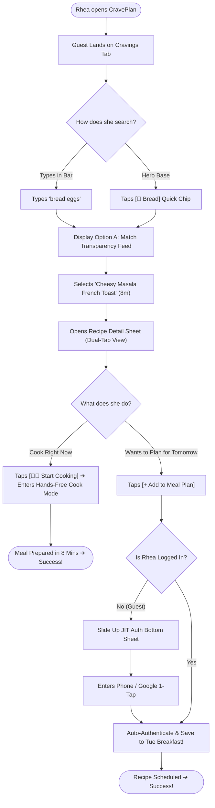
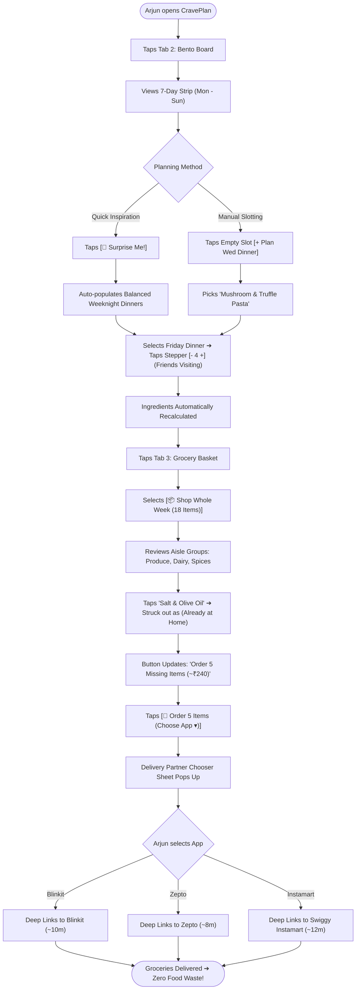
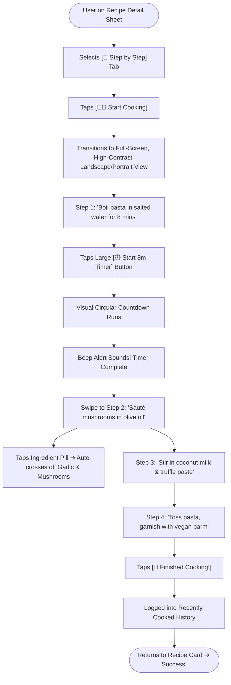

# PHASE 4: MASTER USER FLOWS & LOW-FIDELITY WIREFRAME SPECIFICATIONS
**Project Working Title:** CravePlan (Playful Culinary Operating System)  
**Document Type:** Formal User Task Flows, Edge-Case Logic & Complete 9-Screen Wireframe Blueprint  
**Creative Director & Product Lead:** Aarchi (Fashion Communication, NIFT Hyderabad)  
**Technical Architect & UX Mentor:** Antigravity  
**Repository Location:** `Aarchi_BD-24-1972/PHASE_4_FLOWS_AND_WIREFRAMES.md`  
**Status:** Phase 4 Completed & Signed Off (100% Jury-Ready)  

---

## 1. STRATEGIC AUTHENTICATION ARCHITECTURE: JUST-IN-TIME (JIT) ENGAGEMENT

CravePlan eliminates upfront registration barriers in favor of **Contextual / Just-In-Time (JIT) Authentication**:

```
[ First Launch ] ──▶ [ Splash & Onboarding ] ──▶ [ ⚡ Skip to Browse (Guest Mode) ]
                                                            │
                     ┌──────────────────────────────────────┴──────────────────────────────────────┐
                     ▼                                                                             ▼
          FREE EXPLORATION TIER                                                         COMMITMENT ACTION TRIGGER
     • Browse Cravings Feed & Reels                                                • Tap [+ Add to Meal Plan]
     • Free Search ("bread eggs")                                                  • Tap [❤️ Save to Favorites]
     • Open & Read Full Recipe Detail                                              • Tap [🛒 Export to Blinkit/Zepto]
                                                                                                   │
                                                                                                   ▼
                                                                                   [ 🪟 JIT Auth Bottom Sheet ]
                                                                                   • 1-Tap Google / Phone OTP
                                                                                   • Auto-resumes intended action
```

---

## 2. DETAILED END-TO-END USER TASK FLOWS

### Flow 1: Rhea’s Late-Night Studio Rescue & JIT Auth Flow
* **Persona:** Rhea Sharma (21, NIFT Student).
* **Context:** 10:30 PM, arrives at flat tired, searching for recipes with ingredients on hand.



---

### Flow 2: Arjun’s Sunday 5-Minute Bento Routine & 1-Tap Multi-App Delivery Flow
* **Persona:** Arjun Mehta (25, Product Specialist).
* **Context:** Sunday afternoon, planning weekday meals and ordering groceries without food waste.



---

### Flow 3: Hands-Free "Cook Mode" Execution Flow
* **Persona:** Anyone standing in front of the stove with messy, wet, or oily hands.
* **Context:** Preparing dinner step-by-step with zero phone-screen smudges.



---

## 3. COMPLETE 9-SCREEN LOW-FIDELITY WIREFRAME INVENTORY

---

### Screen 1: First-Launch Gate (Splash & Onboarding Carousel)
```
┌────────────────────────────────────────────────────────┐
│  [SCREEN 1.0: SPLASH]        [SCREEN 1.1: ONBOARDING]  │
├──────────────────────────────┬─────────────────────────┤
│                              │  [ Skip ]               │
│                              │                         │
│                              │     [ 🎨 Illustration ] │
│           CravePlan          │       "Plan Meals in    │
│       [ 🍜 Logo Mark ]       │        3 Minutes"       │
│                              │                         │
│     "Mood-to-Meal in         │  Turn cravings into     │
│       Zero Friction"         │  weekly bento boards &  │
│                              │  1-tap grocery carts.   │
│                              │                         │
│                              │  ( • ○ ○ )              │
│                              │                         │
│                              │  [ Get Started ]        │
│                              │  [ Browse as Guest > ]  │
└──────────────────────────────┴─────────────────────────┘
```

---

### Screen 2: Tab 1 — Cravings (Discovery Feed & Hybrid Rescue)
```
┌────────────────────────────────────────────────────────┐
│  [SCREEN 2.1: TAB 1 - CRAVINGS FEED]                   │
├────────────────────────────────────────────────────────┤
│  Hey Rhea 👋                         [ ❤️ Saved (14) ] │
├────────────────────────────────────────────────────────┤
│  ⚡ HYBRID KITCHEN RESCUE                              │
│  ┌──────────────────────────────────────────────────┐  │
│  │ 🔍 Type what you have (e.g. bread eggs)       🎙️│  │
│  └──────────────────────────────────────────────────┘  │
│  Quick Base: [🍞 Bread] [🥚 Eggs] [🍚 Rice] [🥔 Potato]│
├────────────────────────────────────────────────────────┤
│  EXPLORE CUISINES                                      │
│  [ 🫓 North ] [ 🥥 South ] [ 🥟 Street ] [ 🍝 Italian ] │
├────────────────────────────────────────────────────────┤
│  MOOD CRAVINGS                                         │
│  ( 🔥 #Spicy )   ( 🍋 #Tangy )   ( 🧀 #Creamy )        │
├────────────────────────────────────────────────────────┤
│  FEATURED DISH CARD                                    │
│  ┌──────────────────────────────────────────────────┐  │
│  │ [ 🖼️ Hero Photo / Art ]            [ ▶️ 0:30 Reel ]│  │
│  │                                                  │  │
│  │ CRISPY POTATO & PANEER BURGER     [ 🟢 100% Veg ]│  │
│  │ #Savory • Single-pan friendly                    │  │
│  │ ⏱️ 20 mins   |   👥 Serves: [- 1 +]              │  │
│  ├──────────────────────────────────────────────────┤  │
│  │ [ + Add to Plan ]                 [ 🛒 + Grocery ]│  │
│  └──────────────────────────────────────────────────┘  │
├────────────────────────────────────────────────────────┤
│  [ 🍜 Cravings ]    [ 🗓️ Bento Board ]    [ 🛒 Grocery ]│
└────────────────────────────────────────────────────────┘
```

---

### Screen 3: Search & Rescue Results Screen (Option A: Match Transparency Feed)
```
┌────────────────────────────────────────────────────────┐
│  [SCREEN 2.1.1: SEARCH & RESCUE RESULTS]               │
├────────────────────────────────────────────────────────┤
│  [ ◀ Back ]   🔍 Results for "bread, eggs"  [ 3 Found ]│
├────────────────────────────────────────────────────────┤
│  ┌──────────────────────────────────────────────────┐  │
│  │  🥪 MASALA FRENCH TOAST          ⏱️ 8 mins       │  │
│  │  🟢 100% PANTRY MATCH • Zero Groceries Needed    │  │
│  │  "Uses only bread, eggs, salt, pepper."          │  │
│  │  [ 👨‍🍳 Cook Now ]                 [ + Add to Plan]│  │
│  └──────────────────────────────────────────────────┘  │
│                                                        │
│  ┌──────────────────────────────────────────────────┐  │
│  │  🍳 CHEESY EGG TOAST MELT        ⏱️ 10 mins      │  │
│  │  🟡 1 MISSING ITEM • Easy Jugaad Swap Available  │  │
│  │  "Missing cheese? Swap with butter or dahi!"     │  │
│  │  [ 👨‍🍳 Cook Now ]                 [ + Add to Plan]│  │
│  └──────────────────────────────────────────────────┘  │
│                                                        │
│  ┌──────────────────────────────────────────────────┐  │
│  │  🥚 KOREAN FOLDED EGG SANDWICH   ⏱️ 12 mins      │  │
│  │  🟢 100% PANTRY MATCH • Zero Groceries Needed    │  │
│  │  [ 👨‍🍳 Cook Now ]                 [ + Add to Plan]│  │
│  └──────────────────────────────────────────────────┘  │
└────────────────────────────────────────────────────────┘
```

---

### Screen 4: Recipe Detail Sheet (Dual-Tab Anatomy)
```
┌────────────────────────────────────────────────────────┐
│  [SCREEN 4.0: RECIPE DETAIL SHEET]                     │
├────────────────────────────────────────────────────────┤
│  [ ✕ Close ]       MUSHROOM TRUFFLE PASTA      [ ❤️ ]  │
│  [ 🖼️ Hero Photo / ▶️ 0:30 Micro-Reel Player ]          │
├────────────────────────────────────────────────────────┤
│  SEGMENTED TOGGLE:                                     │
│  ┌────────────────────────┬─────────────────────────┐  │
│  │  📋 INGREDIENTS (8)★   │    🍳 STEP BY STEP      │  │
│  └────────────────────────┴─────────────────────────┘  │
├────────────────────────────────────────────────────────┤
│  (WHEN INGREDIENTS TAB ACTIVE):                        │
│  👥 SERVING SIZE:    [ - ]   2 Servings   [ + ]        │
│                                                        │
│  🥬 FRESH PRODUCE                                      │
│  [✓] 250g Button Mushrooms, sliced                     │
│  [✓] 1 Shallot, finely diced                           │
│  [✓] 3 Cloves of Garlic, sliced                        │
│                                                        │
│  🥛 DAIRY & PLANT                                      │
│  [✓] 1/2 cup Coconut Milk                              │
│                                                        │
│  ✨ JUGAAD SWAP TIP:                                   │
│  "No truffle paste? Use a dash of garlic butter!"      │
├────────────────────────────────────────────────────────┤
│  (WHEN STEPS TAB ACTIVE):                              │
│  1. Boil pasta in salted water (8 mins).               │
│  2. Sauté shallots, garlic, and mushrooms (4 mins).    │
│  3. Simmer coconut milk and truffle paste (5 mins).    │
│  4. Toss pasta with sauce and top with parm (2 mins).  │
├────────────────────────────────────────────────────────┤
│  ┌──────────────────────────────────────────────────┐  │
│  │  👨‍🍳 START HANDS-FREE COOK MODE                  │  │
│  │  (Fullscreen large text + built-in timers)       │  │
│  └──────────────────────────────────────────────────┘  │
│  [ 🛒 + Add to Grocery ]          [ + Add to Plan ]    │
└────────────────────────────────────────────────────────┘
```

---

### Screen 5: The Contextual JIT Auth Bottom Sheet
```
┌────────────────────────────────────────────────────────┐
│  (Background: Blurred Recipe Detail Sheet)             │
├────────────────────────────────────────────────────────┤
│  ┌──────────────────────────────────────────────────┐  │
│  │  ─── (Drag Handle) ───                           │  │
│  │                                                  │  │
│  │  ✨ SAVE TO YOUR BENTO BOARD                     │  │
│  │  "Sign in to schedule meals and sync your        │  │
│  │   grocery checklist to Blinkit & Zepto."         │  │
│  │                                                  │  │
│  │  ┌────────────────────────────────────────────┐  │  │
│  │  │ 📱 Continue with Phone (1-Tap OTP)         │  │  │
│  │  └────────────────────────────────────────────┘  │  │
│  │  ┌────────────────────────────────────────────┐  │  │
│  │  │ G  Continue with Google                    │  │  │
│  │  └────────────────────────────────────────────┘  │  │
│  │                                                  │  │
│  │  [ Maybe Later ]                                 │  │
│  │  🔒 We keep your kitchen habits 100% private.    │  │
│  └──────────────────────────────────────────────────┘  │
└────────────────────────────────────────────────────────┘
```

---

### Screen 6: Tab 2 — Bento Board & Action Menu Sheet
```
┌────────────────────────────────────────────────────────┐
│  [SCREEN 2.2: TAB 2 - BENTO BOARD]                     │
├────────────────────────────────────────────────────────┤
│  🗓️ Bento Meal Board      [ 🎲 Surprise ] [ 🛒 Basket ]│
├────────────────────────────────────────────────────────┤
│  7-DAY STRIP:                                          │
│  [Mon]  [ TUE (Today)★ ]  [Wed]  [Thu]  [Fri]  [Sat]   │
├────────────────────────────────────────────────────────┤
│  ⚡ TUESDAY MEALS (FOCUS DAY EXPANDED):                │
│                                                        │
│  🥞 BREAKFAST: Avocado Sourdough Toast      [ 🟢 Done ] │
│  🥗 LUNCH:     Mediterranean Quinoa Bowl    [ 👥 Serves 2]│
│  🍝 DINNER:    Truffle Mushroom Pasta       [ ... ] ◄──│
│  🍪 SNACK:     [ + Add Snack ] or [ 🍹 Eating Out Slot ]│
├────────────────────────────────────────────────────────┤
│  👀 REST OF WEEK AT A GLANCE (COMPACT MINI-TAGS):      │
│  Wed: 🥪 Paneer Wrap  •  🍜 Miso Ramen (Leftover)      │
│  Thu: 🥞 Banana Crepes • 🥘 Thai Curry                 │
│  Fri: 🍕 Pizza Night   • [ 🍹 Social Night Out ]       │
├────────────────────────────────────────────────────────┤
│  [ 🍜 Cravings ]    [ 🗓️ Bento Board ]    [ 🛒 Grocery ]│
└────────────────────────────────────────────────────────┘
                           │
                           ▼ (Tapping [...] opens action sheet)
┌────────────────────────────────────────────────────────┐
│  ⚙️ MANAGE WEDNESDAY DINNER                             │
│  "Truffle Mushroom Pasta"                              │
├────────────────────────────────────────────────────────┤
│  🔄 [ Swap Recipe ]                                    │
│  📅 [ Move to Another Day ]                            │
│  🍹 [ Change to "Eating Out / Social Night" ]          │
│  🗑️ [ Clear Slot (Remove Meal) ]                       │
│  [ Cancel ]                                            │
└────────────────────────────────────────────────────────┘
```

---

### Screen 7: Tab 3 — Grocery Basket & Delivery Partner Chooser
```
┌────────────────────────────────────────────────────────┐
│  [SCREEN 2.3: TAB 3 - GROCERY BASKET]                  │
├────────────────────────────────────────────────────────┤
│  🛒 Grocery Basket                  [ 📲 WhatsApp Share ]│
│  Auto-synced from Tuesday Meals                        │
├────────────────────────────────────────────────────────┤
│  [ ⚡ Shop Today Only (5) ]    [ 📦 Whole Week (18) ]  │
├────────────────────────────────────────────────────────┤
│  🥬 FRESH PRODUCE                                      │
│  [✓] 250g Button Mushrooms                             │
│  [✓] 1 Shallot / Red Onion                             │
│                                                        │
│  🥛 DAIRY & ALTERNATIVES                               │
│  [✓] 1/2 cup Coconut Milk                              │
│  [✓] 50g Vegan Parmesan                                │
│                                                        │
│  🍞 BAKERY & GRAINS                                    │
│  [✓] 200g Fettuccine Pasta                             │
├────────────────────────────────────────────────────────┤
│  🧂 KITCHEN STAPLES (Assumed at home)      [ Edit ▾ ]  │
│  (Salt, Black Pepper, Olive Oil)                       │
├────────────────────────────────────────────────────────┤
│  ESTIMATED TOTAL: ~₹240                                │
│  ┌──────────────────────────────────────────────────┐  │
│  │ 🛵 Order 5 Items  [ Choose Delivery App ▾ ]      │  │
│  └──────────────────────────────────────────────────┘  │
└────────────────────────────────────────────────────────┘
                           │
                           ▼ (Tapping opens chooser sheet)
┌────────────────────────────────────────────────────────┐
│  🛵 CHOOSE DELIVERY PARTNER                            │
│  "Send 5 ingredients directly to your cart:"           │
├────────────────────────────────────────────────────────┤
│  🟡 Blinkit            • ⏱️ ~10 mins       [ Select ➔ ] │
│  🟣 Zepto              • ⏱️ ~8 mins        [ Select ➔ ] │
│  🟠 Swiggy Instamart   • ⏱️ ~12 mins       [ Select ➔ ] │
│  🔵 Flipkart Minutes   • ⏱️ ~15 mins       [ Select ➔ ] │
├────────────────────────────────────────────────────────┤
│  ☑️ Set as my default delivery app                     │
└────────────────────────────────────────────────────────┘
```

---

### Screen 8: Hands-Free "Cook Mode" (Fullscreen Execution)
```
┌────────────────────────────────────────────────────────┐
│  [SCREEN 4.1: HANDS-FREE COOK MODE]             [ ✕ ]  │
├────────────────────────────────────────────────────────┤
│  TRUFFLE MUSHROOM PASTA • STEP 1 OF 4                  │
│                                                        │
│  ██████████████░░░░░░░░░░░░░░░░░░░░ (25% Complete)     │
├────────────────────────────────────────────────────────┤
│                                                        │
│  Bring a large pot of salted water                     │
│  to a rolling boil. Drop the pasta and                 │
│  cook until 1 minute before al dente.                  │
│                                                        │
│  ┌──────────────────────────────────────────────────┐  │
│  │  ⏱️ BUILT-IN STEP TIMER                          │  │
│  │                                                  │  │
│  │                   08 : 00                        │  │
│  │                                                  │  │
│  │              [ ▶️ Start Timer ]                   │  │
│  └──────────────────────────────────────────────────┘  │
│                                                        │
│  💡 Chef Tip: Save 1/2 cup of pasta water for sauce!   │
├────────────────────────────────────────────────────────┤
│  [ ◀ Previous Step ]               [ Next Step: Sauté ▶]│
└────────────────────────────────────────────────────────┘
```

---

### Screen 9: Saved Recipes & Cooked History Drawer (Header Overlay)
```
┌────────────────────────────────────────────────────────┐
│  [SCREEN 3.0: SAVED & RECENTLY COOKED DRAWER]          │
├────────────────────────────────────────────────────────┤
│  ❤️ MY SAVED COOKBOOK (14)                     [ ✕ ]   │
├────────────────────────────────────────────────────────┤
│  📁 SAVED COLLECTIONS                                  │
│  ┌───────────────────────┐   ┌───────────────────────┐ │
│  │ ⚡ 10m Exam Hacks (6)  │   │ 🍝 Weekend Pastas (4) │ │
│  └───────────────────────┘   └───────────────────────┘ │
│  ┌───────────────────────┐   ┌───────────────────────┐ │
│  │ 🥗 Clean Lunches (4)  │   │ ➕ New Folder         │ │
│  └───────────────────────┘   └───────────────────────┘ │
├────────────────────────────────────────────────────────┤
│  🕒 RECENTLY COOKED HISTORY                            │
│  • Masala French Toast (Cooked Yesterday • 8 mins)     │
│  • Quinoa Mediterranean Bowl (Cooked Tuesday • 15 mins)│
└────────────────────────────────────────────────────────┘
```

---

## 4. UI COMPONENT STATES & EDGE-CASE HANDLING

| Component / Screen | Empty State | Loading / Active State | Success / Confirmation State |
| :--- | :--- | :--- | :--- |
| **Search & Rescue** | *"No recipes match those exact items. Try tapping a Hero Base chip above!"* | Shimmer loading skeleton cards. | 🟢 Green 100% Match banner with count badge. |
| **Bento Slot** | Dashed outline with `[+ Add Dinner]` invite. | Smooth pulse animation during "Surprise Me" dice roll. | Solid bento card with meal name and prep time. |
| **Grocery Basket** | *"Your basket is empty! Add meals from your Bento Board."* | Spinner on delivery button while building deep-link payload. | Toast: *"Ingredients copied! Opening Blinkit..."* |
| **Cook Mode Timer** | Static `08:00` display with Play button. | Circular countdown with ticking ring. | Screen flash + audio chime alert (*"Time's up!"*). |

---

## 5. PHASE GATE SIGN-OFF

### Status: Phase 4 Complete & 100% Signed Off
* [x] Just-In-Time (JIT) Contextual Authentication logic formalized.
* [x] 3 Complete Task Flows (Rhea Rescue, Arjun Bento, Hands-Free Cook) mapped.
* [x] Complete 9-Screen Low-Fidelity Wireframe Blueprint created.
* [x] Option A Match Transparency Feed integrated for Search Results.
* [x] Option A `[...]` Action Sheet Menu integrated for Bento Board management.
* [x] Dual-Tab Toggle (`[📋 Ingredients]` | `[🍳 Steps]`) integrated for Recipe Details.
* [x] Multi-App Delivery Partner Chooser with free Deep-Linking integrated.
* [x] UI Component States (Empty, Active, Error, Success) documented.

---
### 📍 Up Next: **Phase 5: Visual Design System & Tokens**
* Visual Design Language (Culinary Editorial, Tactile & Playful).
* Color Palette Tokens (Terracotta, Matcha, Saffron, Whipped Cream, Char Charcoal).
* Typography System (Editorial Serif headers + Clean Sans UI body).
* Microcopy & Voice Guidelines (Encouraging, warm, zero diet guilt).
* UI Component Library (Buttons, Steppers, Bento Tiles, Pills, Action Sheets).
